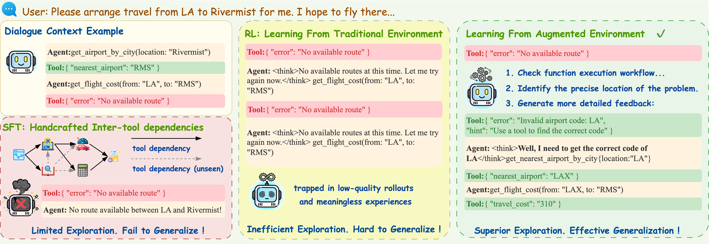
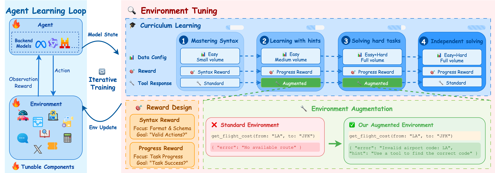
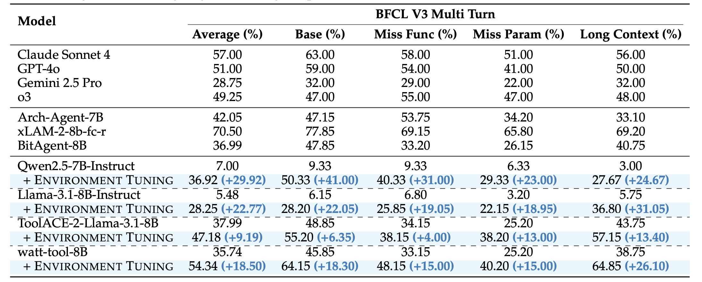

<div align="center">

<h1 align="center">
Agentic Learning Powered by <a href="https://github.com/inclusionAI/AWorld">AWorld</a>
</h1>

</div>

<p align="center">
 <a href="https://arxiv.org/abs/2601.01498" target="_blank">arXiv(HardGen)</a>
 <a href="https://arxiv.org/abs/2508.13634" target="_blank">arXiv(V2P)</a> ｜
 <a href="https://arxiv.org/abs/2507.02962v5" target="_blank">arXiv(RAG-R1)</a> ｜
 <a href="https://arxiv.org/abs/2505.20192" target="_blank">arXiv(FunReason)</a> ｜
 <a href="https://arxiv.org/abs/2510.10197" target="_blank">arXiv(EnvTuning)</a>｜
 <a href="https://arxiv.org/abs/2510.24645" target="_blank">arXiv(FunReason-MT)</a>｜
</p>


<p align="center">
 <a href="http://xhslink.com/o/A5W5duyHWlf" target="_blank">EnvTuning</a>
</p>

## 📣 News

[2026/01/26] 🎉🎉🎉[Environment Tuning](https://arxiv.org/abs/2510.10197) was accepted at [ICLR 2026](https://iclr.cc/) conference!

[2026/01/04] 🔥🔥🔥[**HardGen**](./FunReason-MT) We propose **HadrGen**, an extension of the FunReason-MT.

[2025/10/29] 🔥🔥🔥[**FunReason-MT**](./FunReason-MT) We propose **FunReason-MT**, a novel data synthesis framework designed to address critical bottlenecks in multi-turn **Function Calling (FC)** data generation, achieving excellent performance in complex agentic tasks.

[2025/10/22] 🔥🔥🔥[**EnvTuning**](./EnvTuning) We propose **Environment Tuning**, a novel training paradigm that enables agents to learn complex multi-turn tool use behaviors through environmental interaction rather than trajectory imitation, achieving significant improvements with only 400 training samples.

[2025/08/19] 🔥🔥🔥[**V2P**](./V2P) We propose **V2P**, a novel training method for multi-modal models that enables coordinate-free, human-like visual GUI Grounding.

[2025/07/01] 🔥🔥🔥[**RAG-R1**](./RAG-R1) We propose **RAG-R1**, a deepsearch training framework that incentivizing the search and reasoning capabilities of LLMs through multi-query parallelism.(**AAAI2026 Accepted**)

[2025/05/16] 🔥🔥🔥[**FunReason**](https://github.com/BingguangHao/FunReason/) We propose **FunReason**, a novel framework that enhances LLMs' function calling capabilities through an automated data refinement strategy and a Self-Refinement Multiscale Loss approach.

## 📖 Introduction

**AWorld-RL** is a comprehensive collection of cutting-edge agentic reinforcement learning algorithms developed by the AWorld Team. Built upon the [AWorld Framework](https://github.com/inclusionAI/AWorld), this repository provides complete **codebases**, **datasets**, and **checkpoints** for training and evaluating autonomous agents that learn through multi-turn interactions with dynamic environments.

Our work focuses on enabling agents to effectively leverage environmental feedback for complex problem-solving across diverse domains, including multi-modal understanding, deep search, and function calling.


## 🚀 Projects

**[From Failure to Mastery: Generating Hard Samples for Tool-use Agents](./FunReason-MT)**  
**Authors:** Bingguang Hao, Zengzhuang Xu, Yuntao Wen, Xinyi Xu, Yang Liu et al. 
[](https://arxiv.org/abs/2601.01498) [](https://huggingface.co/Bingguang/FunReason-MT)[](https://huggingface.co/datasets/Bingguang/FunReason-MT)

**[FunReason-MT Technical Report: Advanced Data Synthesis Solution for Real-world Multi-Turn Tool-use](./FunReason-MT)**  
**Authors:** Zengzhuang Xu, Bingguang Hao, Zechuan Wang et al. 
[](https://arxiv.org/abs/2510.24645) [](https://huggingface.co/Bingguang/FunReason-MT)[](https://huggingface.co/datasets/Bingguang/FunReason-MT)

**[Don't Just Fine-tune the Agent, Tune the Environment](./EnvTuning)**  
**Authors:** Siyuan Lu, Zechuan Wang, Hongxuan Zhang, Qintong Wu, Leilei Gan, Chenyi Zhuang, Jinjie Gu, Tao Lin  
[](https://arxiv.org/abs/2510.10197) [](https://huggingface.co/papers/2510.10197)

**[V2P: From Background Suppression to Center Peaking for Robust GUI Grounding](./V2P)**  
**Authors:** Jikai Chen, Long Chen, Dong Wang, Leilei Gan, Chenyi Zhuang, Jinjie Gu  
[](https://arxiv.org/abs/2508.13634) [](https://huggingface.co/papers/2508.13634) [](https://huggingface.co/inclusionAI/V2P-7B)

**[RAG-R1: Incentivizing the Search and Reasoning Capabilities of LLMs Through Multi-query Parallelism](./RAG-R1)**  
**Authors:** Zhiwen Tan, Jiaming Huang, Qintong Wu, Hongxuan Zhang, Chenyi Zhuang, Jinjie Gu  
[](https://arxiv.org/abs/2507.02962v5) [](https://huggingface.co/papers/2507.02962)

**[FunReason: Enhancing Large Language Models' Function Calling via Self-Refinement Multiscale Loss and Automated Data Refinement](https://github.com/BingguangHao/FunReason/)**  
**Authors:** Bingguang Hao, Maolin Wang, Zengzhuang Xu, Cunyin Peng, Yicheng Chen, Xiangyu Zhao, Jinjie Gu, Chenyi Zhuang  
[](https://arxiv.org/abs/2505.20192) [](https://huggingface.co/papers/2505.20192)
                         
## 📚 Overview

### Table of Contents

- [Multi-Modal](#multi-modal)
  - [V2P](#v2p)
- [Deepsearch](#deepsearch)
  - [RAG-R1](#rag-r1)
- [Tool Use](#tool-use)
  - [FunReason-MT](#funreason-mt)
  - [Environment Tuning](#environment-tuning)
  - [FunReason](#funreason)


### Multi-Modal
#### [V2P](./V2P) 

- Tools: PyAutoGUI Tools
- LLM: Qwen2.5-7b-instruct

<div align="center">
  
  <p>Overall framework of V2P.</p>
</div>

<div align="center">
  
  <p>Performance on both ScreenSpot-v2 (left) and ScreenSpot-Pro (right).</p>
</div>
  

### Deepsearch

#### [RAG-R1](./RAG-R1)

- Tools: Search Engines (offline or [online](https://github.com/qingw-dev/aworld-mcp-servers))
- LLM: Qwen2.5-7b-instruct

<div align="center">
  
  <p>Overall framework of RAG-R1.</p>
</div>

<div align="center">
  
  <p>Performance comparisons on QA benchmarks under the EM metric. The best and second best results are bold and underlined, respectively.</p>
</div>

### Tool Use
#### [FunReason-MT](./FunReason-MT)
- Tools: Multi-turn Tool Use (BFCLv3 Benchmark)
- LLM: Qwen3-4b-Instruct-2507

##### Key Highlights:

* **State-of-the-Art Performance:** A 4B model trained on FunReason-MT data achieves state-of-the-art results among similarly sized models on the **Berkeley Function-Calling Leaderboard (BFCLv3)** Multi-Turn benchmark.
* **Closed-Source Model Outperformance:** The FunReason-MT RL-trained 4B model surpasses most leading closed-source models (e.g., GPT-5, Gemini-2.5-Pro, Claude-Sonnet-4) and open-source models (e.g., DeepSeek-R1) in Multi-Turn evaluation.
* **Robust Framework:** The solution addresses three structural deficiencies in data generation: **Targeted Model Training**, **Isolation of Tool Architecture**, and **Multi-Turn Logical Dependency**.
* **Agentic Generalization:** The model demonstrates promising out-of-distribution generalization and improved agentic capability on the **BFCLv4** benchmark (Web Search and Memory tasks).

---

##### 🔬 Methodology: The FunReason-MT Framework

The framework tackles complexity and reliability challenges by breaking the data generation process into three core phases:

| Phase               | Core Component                                                       | Challenge Addressed                                    | Description                                                                                                                                                                                                                                                                                                  |
| :------------------ | :------------------------------------------------------------------- | :----------------------------------------------------- | :----------------------------------------------------------------------------------------------------------------------------------------------------------------------------------------------------------------------------------------------------------------------------------------------------------- |
| **Phase I**   | **Environment-API Graph Interactions**  | Targeted Model Training         | Samples tool calls using a **Directed Sampler** to efficiently collect multi-turn trajectories centered around a target complex tool ($T_a$).                                                                                                                            |
| **Phase II**  | **Advanced Tool-Query Synthesis**       | Isolation of Tool Architecture  | A **Tooling Agent** abstracts the multi-step execution trace into a single **Advanced Tool** ($T_{adv}$). A **Querying Agent** then reverse-engineers a challenging **Hard Query** ($Q_{hard}$) requiring this abstraction. |
| **Phase III** | **Guided Iterative Chain**              | Multi-Turn Logical Dependency   | A **Reasoning Agent** attempts to solve $Q_{hard}$. A **Critiquing Agent** analyzes failures and provides targeted, corrective feedback, creating an iterative self-correction loop to enforce CoT accuracy.                                                   |

<div align="center">
  
</div>

---

##### 📈 Experimental Results (BFCL Leaderboard)

The model achieves state-of-the-art performance, particularly after applying Reinforcement Learning (RL) on the synthesized data.

###### BFCLv3 Multi-Turn and Single-Turn Performance

| Model (4B - 235B)                      |             Multi-Turn (Overall)             |            Single-Turn (Overall)            |
| :------------------------------------- | :------------------------------------------: | :------------------------------------------: |
| Qwen3-4B-Instruct (Base)               |        15.75         |        78.19         |
| **Qwen3-4B + FunReason-MT (RL)** | **57.75**  | **85.47**  |
| Claude-Sonnet-4-20250514               |        54.75         |        84.72         |
| DeepSeek-R1-0528                       |        44.50         |        78.22         |
| GPT-4o-2024-11-20                      |        42.50         |        77.21         |

###### BFCL Agentic Evaluation (BFCLv4 OOD)

The FunReason-MT trained model leads in out-of-distribution agentic tasks (Web Search and Memory).

| Model                          |             BFCLv4 Overall Score             |
| :----------------------------- | :------------------------------------------: |
| **FunReason-MT-4B (RL)** | **15.10**  |
| ToolACE-2-8B                   |      14.83       |
| BitAgent-8B                    |      8.24       |
| XLAM-2-3b-fc-r                 |      7.42       |
| watt-tool-8B                   |    6.30     |

---


#### [Environment Tuning](./EnvTuning)

- Tools: Multi-turn Tool Use (BFCL Benchmark)
- LLM: Qwen2.5-7B-Instruct, Llama-3.1-8B-Instruct, watt-tool-8B

Training agents for complex multi-turn tool use tasks faces critical challenges: extreme scarcity of high-quality training data, overfitting with supervised fine-tuning (SFT) on synthetic data, and cold-start problems with training instability in standard reinforcement learning approaches. **Environment Tuning** addresses these challenges through a novel training paradigm that enables agents to learn complex behaviors through environmental interaction rather than trajectory imitation, even with minimal data.

<div align="center">
  
  <p>Limitations of existing paradigms (SFT overfitting and standard RL cold-start) and the advantages of Environment Tuning approach.</p>
</div>

<div align="center">
  
  <p>Four-stage curriculum learning pipeline with actionable environment augmentation and fine-grained progress rewards.</p>
</div>

<div align="center">
  
  <p>With only 400 training samples, Environment Tuning achieves significant improvements on BFCL V3.</p>
</div>


#### [FunReason](https://github.com/BingguangHao/FunReason/)

- Tools: Real Human Function calling (BFCLv2 live&non-live)
- LLM: Qwen2.5-7b-Coder-instruct

FunReason is a framework designed to enhance LLMs' function calling capabilities, achieving GPT-4o-comparable performance on BFCL, surpassing RL-based methods, mitigating catastrophic forgetting on HumanEval and MBPP, and using a data refinement strategy where natural CoT data outperforms artificial ones.

<div align="center">
  
  <p>Data refinement pipeline of FunReason.</p>
</div>

**Overview of FunReason's data refinement pipeline.** The pipeline consists of five stages: Function Call Classification, Query and Tool Identification, CoT Identification, Function and Parameter Identification, and Format Identification. Each stage ensures specific aspects of data quality, with failing examples either being discarded or regenerated.

<div align="center">
  
  <p>Performance of FunReason.</p>
</div>

## Citation

Please cite our repo if our works are helpful for your research.
```
@article{xu2025funreason,
  title={FunReason-MT Technical Report: Advanced Data Synthesis Solution for Real-world Multi-Turn Tool-use},
  author={Zengzhuang Xu, Bingguang Hao, Zechuan Wang, Yuntao Wen, Xinyi Xu, Yang Liu, Long Chen, Dong Wang, Maolin Wang, Tong Zhao, Yicheng Chen, Cunyin Peng, Jinjie Gu, Leilei Gan, Xiangyu Zhao, Chenyi Zhuang, Shi Gu},
  journal={arXiv preprint arXiv:2510.24645},
  year={2025}
}

@article{lu2025don,
  title={Don't Just Fine-tune the Agent, Tune the Environment},
  author={Lu, Siyuan and Wang, Zechuan and Zhang, Hongxuan and Wu, Qintong and Gan, Leilei and Zhuang, Chenyi and Gu, Jinjie and Lin, Tao},
  journal={arXiv preprint arXiv:2510.10197},
  year={2025}
}

@article{chen2025v2p,
  title={V2P: From Background Suppression to Center Peaking for Robust GUI Grounding Task},
  author={Chen, Jikai and Chen, Long and Wang, Dong and Gan, Leilei and Zhuang, Chenyi and Gu, Jinjie},
  journal={arXiv preprint arXiv:2508.13634},
  year={2025}
}

@article{tan2025rag,
  title={RAG-R1 : Incentivizing the Search and Reasoning Capabilities of LLMs through Multi-query Parallelism},
  author={Tan, Zhiwen and Huang, Jiaming and Wu, Qintong and Zhang, Hongxuan and Zhuang, Chenyi and Gu, Jinjie},
  journal={arXiv preprint arXiv:2507.02962v5},
  year={2025}
}

@article{hao2025funreason,
  title={FunReason: Enhancing Large Language Models' Function Calling via Self-Refinement Multiscale Loss and Automated Data Refinement},
  author={Hao, Bingguang and Wang, Maolin and Xu, Zengzhuang and Peng, Cunyin and Chen, Yicheng and Zhao, Xiangyu and Gu, Jinjie and Zhuang, Chenyi},
  journal={arXiv preprint arXiv:2505.20192},
  year={2025}
}
```

## 📞 Contact

For any question or feedback, please reach out to us at [ender.tzw@antgroup.com](mailto:ender.tzw@antgroup.com) or [chenyi.zcy@antgroup.com](mailto:chenyi.zcy@antgroup.com)

## License

This project is licensed under the [MIT License](LICENSE).
